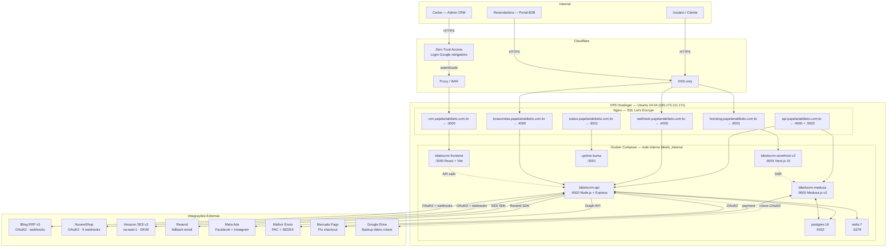

# 🎀 BibelôCRM — Ecossistema Papelaria Bibelô

> CRM + Hub de Marketing + E-commerce próprio da **Papelaria Bibelô** — Timbó/SC.
> Sistema full-stack construído do zero, rodando em produção.

[](https://github.com/carloseduardomcosta/bibelo_ecossistema/actions/workflows/deploy.yml)


---

## O que é isso?

O **BibelôCRM** centraliza tudo que uma papelaria moderna precisa gerenciar:

| Módulo | O que faz |
|--------|-----------|
| **CRM** | Clientes, score RFM, timeline, segmentos, deals, pipeline |
| **ERP** | Sync bidirecional com Bling, NuvemShop, estoque, lucratividade |
| **Marketing** | 11 fluxos automáticos, 23 templates email, popup captura, tracking comportamental |
| **E-commerce** | Medusa.js v2 + Next.js Storefront, Mercado Pago Pix, Melhor Envio |
| **Financeiro** | Fluxo de caixa, DRE, NF de entrada, despesas fixas, contas a pagar |
| **B2B Revendedoras** | Portal Sou Parceira: 5 tiers, preço server-side, OTP via CPF, threads de mensagens |
| **Ads** | Dashboard Meta Ads (Facebook + Instagram) integrado |
| **Infra** | CI/CD, backup automático Google Drive, firewall, Uptime Kuma |

---

## Arquitetura geral



---

## Stack técnica

| Camada | Tecnologia | Versão |
|--------|-----------|--------|
| Backend API | Node.js + TypeScript + Express | 20 / 5 |
| Banco de dados | PostgreSQL | 16 |
| Cache + Filas | Redis + BullMQ | 7 |
| Frontend CRM | React + Vite + TailwindCSS | 18 |
| E-commerce engine | Medusa.js v2 | 2.13.5 |
| Storefront | Next.js (App Router) | 15 |
| Containers | Docker + Docker Compose | — |
| Reverse proxy | Nginx + SSL Let's Encrypt | — |
| CI/CD | GitHub Actions → rsync | — |
| Email primário | Amazon SES v2 (sa-east-1) | — |
| Email fallback | Resend | — |
| Pagamentos | Mercado Pago Pix | — |
| Frete | Melhor Envio | — |
| DNS / WAF | Cloudflare | — |
| Auth CRM | Cloudflare Zero Trust | — |
| Monitoramento | Uptime Kuma | — |
| Backup | Google Drive via rclone | — |

---

## Containers em produção

```
CONTAINER                IMAGEM               PORTA        STATUS
bibelo_api               bibelocrm-api        4000         healthy
bibelo_frontend          bibelocrm-frontend   3000         healthy
bibelo_medusa            bibelocrm-medusa     9000         healthy
bibelo_storefront_v2     bibelocrm-storefront-v2 8001      healthy
bibelo_postgres          postgres:16          5432         healthy
bibelo_redis             redis:7              6379         healthy
bibelo_uptime            uptime-kuma          3001         healthy
```

---

## Estrutura do repositório

```
bibelo_ecossistema/
├── api/                    # Backend Node.js + Express
│   └── src/
│       ├── routes/         # ~25 arquivos de rotas
│       ├── services/       # flow.service.ts, customer.service.ts
│       ├── integrations/   # bling/, nuvemshop/, ses/, resend/
│       ├── queues/         # BullMQ: sync.queue, flow.queue
│       ├── middleware/     # auth.ts (JWT)
│       └── db/             # pool + query helpers + migrate
│
├── frontend/               # CRM — React + Vite
│   └── src/
│       ├── pages/          # ~25 páginas
│       └── components/     # Layout, Toast, GlobalSearch
│
├── medusa/                 # E-commerce engine — Medusa.js v2
├── storefront-v2/          # Loja pública — Next.js 15
│
├── db/
│   └── migrations/         # 034 migrations SQL em ordem numérica
│
├── scripts/
│   ├── setup.sh            # setup completo do VPS
│   ├── backup.sh           # dump PG → Google Drive
│   ├── dr-backup.sh        # snapshot completo semanal
│   └── test.sh             # roda testes Vitest
│
├── docs/
│   ├── api/rotas.md        # referência completa dos ~120 endpoints
│   ├── claude/             # referências para o agente Claude Code
│   ├── integracoes/        # Bling, NuvemShop, WhatsApp, Meta Ads
│   ├── infra/              # segurança, pentest, DNS
│   ├── ecommerce/          # Medusa, storefront, imagens
│   └── projeto/            # roadmap, commits, auditoria
│
├── .github/workflows/
│   └── deploy.yml          # CI/CD: build → testes → rsync → docker → health
│
├── docker-compose.yml
└── CLAUDE.md               # instruções para o agente Claude Code
```

---

## CI/CD — Deploy automático

O deploy acontece automaticamente a cada `git push origin main`.

### Fluxo

```
git push
  └── GitHub Actions
        ├── 1. Build API (npm ci + tsc)
        ├── 2. Build Frontend (npm ci + vite build)
        └── 3. Deploy VPS
              ├── rsync código → VPS
              ├── npm install (dependências de teste)
              ├── bash scripts/test.sh  ← aborta se falhar
              ├── docker compose up -d --build
              ├── health check API
              └── notifica via webhook interno
```

### Secrets necessários no GitHub

Acesse **Settings → Secrets and variables → Actions** no repositório e cadastre:

| Secret | Valor | Como obter |
|--------|-------|------------|
| `VPS_SSH_KEY` | Chave privada SSH (ed25519) | `cat ~/.ssh/id_ed25519` na VPS |
| `VPS_HOST` | IP da VPS | `185.173.111.171` |
| `APP_DOMAIN` | Domínio da API | `crm.papelariabibelo.com.br` |
| `INTERNAL_NOTIFY_KEY` | Chave do webhook interno | valor em `.env` → `INTERNAL_NOTIFY_KEY` |

> **Atenção:** a chave SSH deve ser a **privada** (`id_ed25519`), não a pública. A pública (`id_ed25519.pub`) precisa estar em `~/.ssh/authorized_keys` na VPS.

#### Gerar o par de chaves SSH para o CI/CD

```bash
# Na sua máquina local ou diretamente na VPS
ssh-keygen -t ed25519 -C "github-actions-bibelo" -f ~/.ssh/github_actions_bibelo

# Copiar a pública para authorized_keys na VPS
cat ~/.ssh/github_actions_bibelo.pub >> ~/.ssh/authorized_keys

# Copiar a privada → colar no GitHub Secret VPS_SSH_KEY
cat ~/.ssh/github_actions_bibelo
```

---

## Setup do ambiente de desenvolvimento

### Pré-requisitos
- Node.js 20+
- Docker + Docker Compose
- PostgreSQL 16 (ou via Docker)

### 1. Clonar e configurar

```bash
git clone git@github.com:carloseduardomcosta/bibelo_ecossistema.git
cd bibelo_ecossistema

# Copiar variáveis de ambiente
cp .env.example .env
# Editar .env com as credenciais reais
```

### 2. Subir com Docker

```bash
docker compose up -d
```

### 3. Verificar saúde

```bash
curl http://localhost:4000/health
# → {"status":"ok"}
```

### 4. Rodar testes

```bash
bash scripts/test.sh
# → 522 testes passando
```

---

## Domínios e serviços

| Domínio | Serviço | Acesso |
|---------|---------|--------|
| `crm.papelariabibelo.com.br` | CRM interno | Cloudflare Zero Trust (Google login) |
| `api.papelariabibelo.com.br` | API + Medusa Admin | Cloudflare proxy |
| `webhook.papelariabibelo.com.br` | Webhooks Bling/NuvemShop + email proxy | DNS-only |
| `souparceira.papelariabibelo.com.br` | Portal B2B Revendedoras (Nginx → :4000) | Público |
| `homolog.papelariabibelo.com.br` | Storefront Next.js (homolog) | Público |
| `boasvindas.papelariabibelo.com.br` | Página de links + formulários | Público |
| `status.papelariabibelo.com.br` | Uptime Kuma | Público |

---

## Schemas do banco de dados

```
crm         → customers, interactions, deals, segments, tracking_events
              revendedoras, revendedora_pedidos, revendedora_pedido_itens,
              revendedora_estoque, revendedora_conquistas, revendedora_pedido_mensagens
marketing   → templates (slug), campaigns, flows, leads, email_events
sync        → bling_orders, bling_products, nuvemshop_orders, fornecedor_catalogo_jc
financeiro  → lancamentos, notas_entrada, despesas_fixas, canais_venda
public      → users, sessions, store_settings, notificacoes, migrations
```

---

## Funcionalidades principais

### CRM
- Score RFM automático (Recência · Frequência · Valor monetário)
- Timeline unificada: pedidos + emails + comportamento no site
- Pipeline de deals com automação
- Segmentação dinâmica por comportamento

### Marketing Automation
- Motor de fluxos com **branching condicional** (7 tipos de condição)
- Dedup de templates: evita reenviar o mesmo email nas últimas 72h
- Rastreamento comportamental no site (page_view, product_view, add_to_cart, checkout)
- Captura de leads com verificação de email + cupom BIBELO10 (10% OFF)
- Cupons únicos por lead via NuvemShop API

### E-commerce
- **Medusa.js v2** como engine (145 produtos, 32 com variantes)
- **Sync Bling → Medusa** via BullMQ (30min) + webhook real-time
- **Mercado Pago Pix** + cartão + boleto (checkout transparente)
- **Melhor Envio** PAC + SEDEX com etiqueta automática

### Portal B2B — Programa Sou Parceira

Portal dedicado para revendedoras em `souparceira.papelariabibelo.com.br`.

| Tier | Volume mensal | Desconto | Frete |
|------|--------------|----------|-------|
| Iniciante | < R$ 150 | 15% | Por conta da revendedora |
| Bronze | R$ 150–599 | 25% | Por conta da revendedora |
| Prata | R$ 600–1.199 | 35% | Por conta da revendedora |
| Ouro | R$ 1.200–2.999 | 45% | **Grátis** (Bibelô arca) |
| Diamante | R$ 3.000+ | 45% | **Grátis** + benefícios exclusivos |

- Autenticação passwordless: CPF + OTP de 6 dígitos (email, expira em 10 min)
- JWT com `iss: "souparceira"` — completamente isolado do JWT do CRM
- Preço **sempre** calculado server-side: `preco_custo × markup × (1 − desconto%)`
- Custo de aquisição e markup nunca expostos para a revendedora
- Thread de mensagens por pedido (revendedora ↔ admin)
- 3 templates de email editáveis via CRM (boas-vindas, status do pedido, nova mensagem)
- Catálogo aprovado com ~1.200 produtos JC Atacado
- Gamificação: conquistas, progresso de nível, streak mensal

Documentação completa: [docs/sou-parceira.md](docs/sou-parceira.md)

---

## Documentação detalhada

- [Rotas da API (~120 endpoints)](docs/api/rotas.md)
- [Programa Sou Parceira — documentação completa](docs/sou-parceira.md)
- [Banco de dados — schemas completos](docs/claude/banco-schemas.md)
- [Fluxos de email e templates](docs/claude/email-fluxos.md)
- [Infraestrutura e segurança](docs/infra/seguranca.md)
- [Catálogo fornecedor JC Atacado](docs/claude/fornecedor-catalogo.md)
- [Sync Bling → Medusa](docs/claude/sync-bling-medusa.md)
- [Storefront v2](docs/claude/storefront.md)
- [Integrations overview](docs/claude/integracoes.md)
- [Roadmap por fases](docs/projeto/roadmap.md)
- [Histórico de commits](docs/projeto/commits.md)

---

## Segurança

- Cloudflare Zero Trust no CRM (login Google obrigatório)
- SSH na porta `60222` + Fail2ban (ban permanente após 1 tentativa)
- UFW: apenas portas 60222, 80, 443 abertas
- Banco e Redis acessíveis apenas internamente via Docker network
- Todos os inputs validados com Zod
- Queries SQL sempre com `$1, $2` (sem concatenação)
- Rate limiting em todos os endpoints públicos
- HMAC com `timingSafeEqual` nos webhooks
- DMARC `p=reject` + SPF hardfail + DKIM

---

## Backup

- **Diário 3:30h** → dump PostgreSQL → Google Drive (rclone OAuth2) — retenção 30 dias
- **Semanal domingo 4h** → snapshot completo (env, nginx, SSL, certs, DB CRM + Medusa) — retenção 60 dias
- **DR:** recuperação estimada em ~30 minutos em VPS nova

---

*BibelôCRM — Ecossistema Bibelô · Timbó/SC · 2026*
