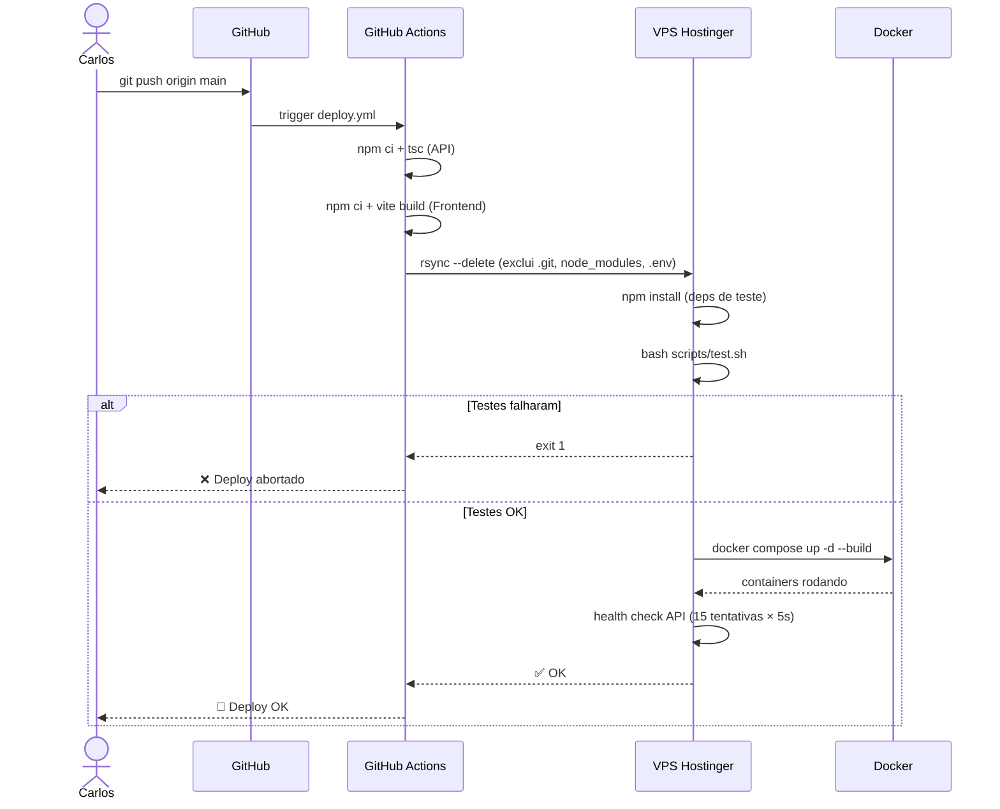
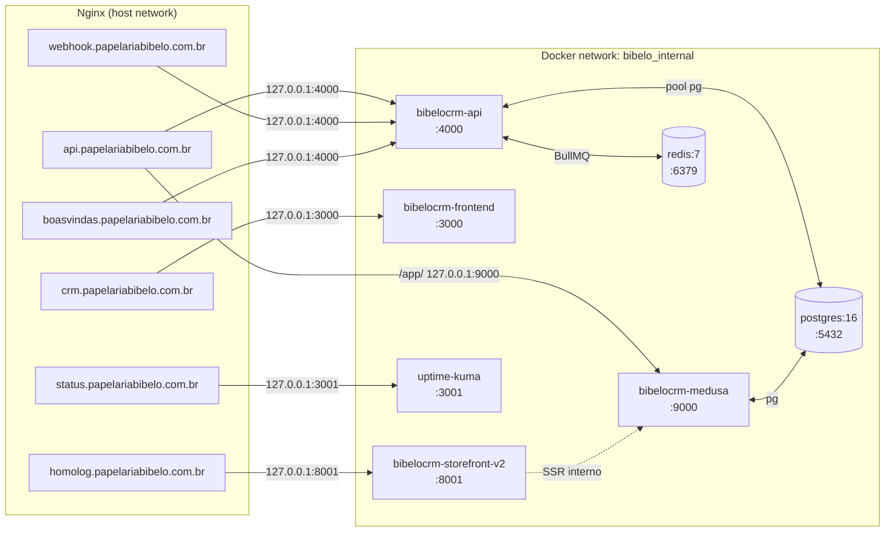
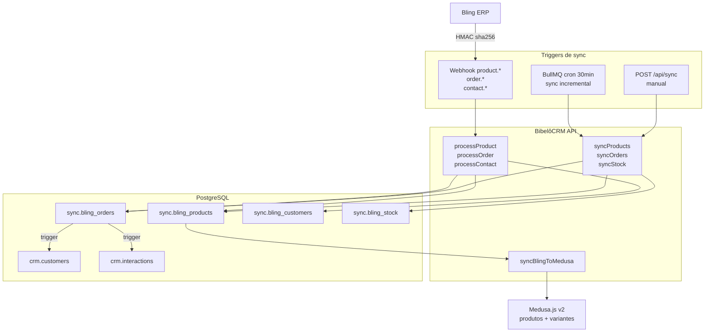
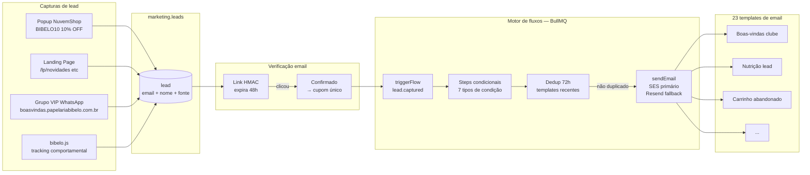
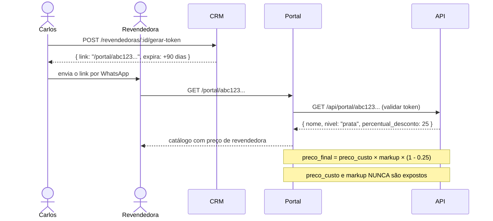
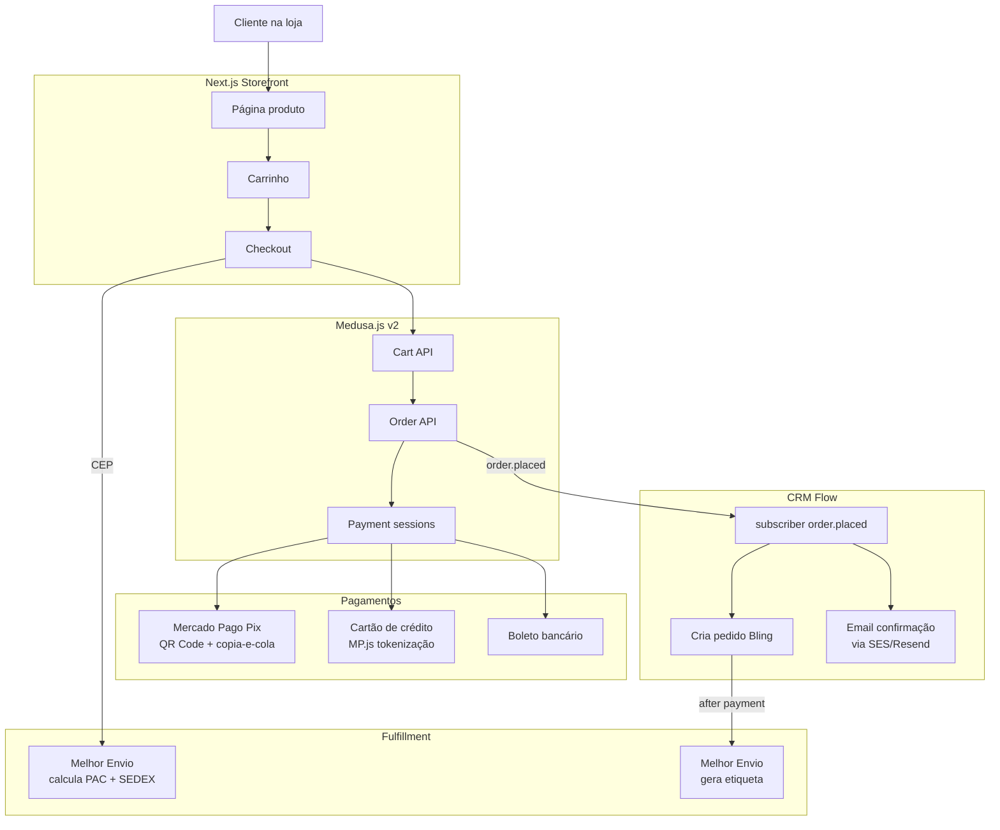
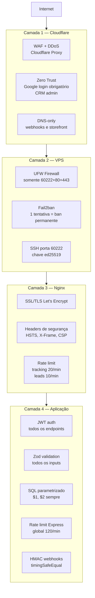
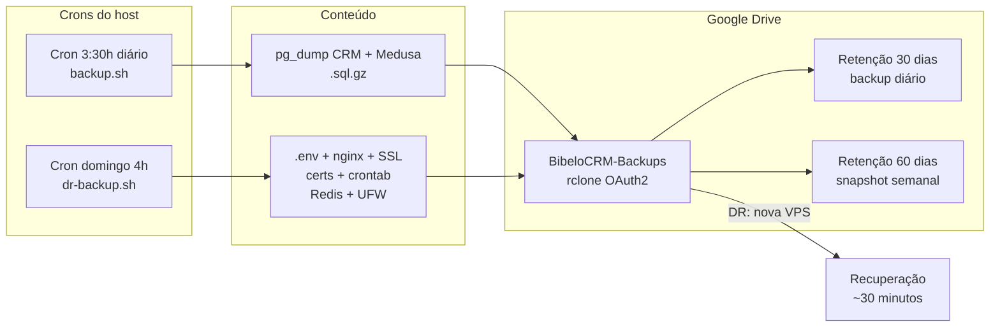

# Arquitetura do Ecossistema Bibelô

> Visão técnica completa — atualizado em 12/04/2026

---

## Fluxo de deploy (CI/CD)

---

## Rede Docker interna

---

## Fluxo de sync Bling → Sistema

---

## Fluxo de marketing (lead → email)

---

## Portal B2B Revendedoras

---

## Fluxo de compra (storefront)

---

## Segurança em camadas

---

## Backup e DR

